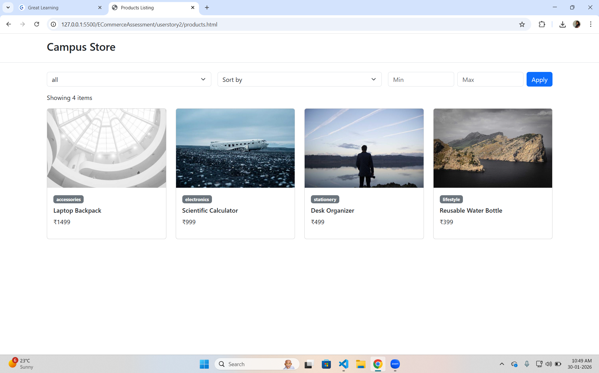
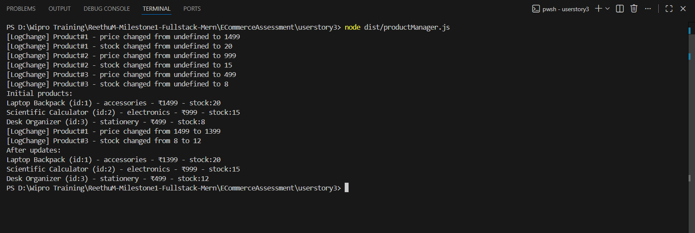

# Campus Essentials – Product Management System

Milestone Assessment – Front-End Development & TypeScript

This project is part of a front-end development milestone assessment.  
It demonstrates responsive UI design, dynamic product listing using JavaScript,  
and product management using TypeScript.

---

## 📂 Project Structure

```text
ECommerceAssessment/
│
├── userstory1/
│   ├── index.html
│   ├── style.css
│
├── userstory2/
│   ├── products.html
│   ├── script.js
│   ├── products.json
│
├── userstory3/
│   ├── productManager.ts
│   ├── tsconfig.json
│   └── dist/
│       └── productManager.js
│
├── screenshots/
│   ├── home.png
│   ├── api_output.png
│   └── ts_output.png
│
└── ECommerceAssessment.pdf
```

---

## 🧩 Overview

| User Story | Focus Area | Description | Tech Stack |
|-----------|-----------|-------------|-----------|
| 1 | HTML5, CSS3, Bootstrap | Product showcase homepage with responsive layout and subscription form | HTML, CSS, Bootstrap, JavaScript |
| 2 | JavaScript, Fetch API | Dynamic product listing with filtering and sorting | JavaScript, JSON |
| 3 | TypeScript | Product management using interfaces, classes, and decorators | TypeScript |

---

## 🚀 Features

### 🏠 User Story 1 – Home Page
- Responsive layout using Bootstrap
- Navigation bar with links
- Product card with hover effects
- Newsletter subscription form with validation
- Dynamic footer year using JavaScript

**Run**
```text
Open userstory1/index.html in your browser
```

---

### 📦 User Story 2 – Product Listing Page
- Fetches data from products.json
- Category-based filtering
- Price range filter
- Sorting by price
- Displays total items dynamically

**Run**
```text
Open userstory2/products.html in your browser
```

---

### ⚙️ User Story 3 – Product Management (TypeScript)
- Uses IProduct interface
- Product class with decorators
- Logs price and stock changes
- Uses Map for product storage
- Compiles TypeScript to JavaScript

**Run**
```bash
cd userstory3
tsc
cd dist
node productManager.js
```

---

## 📸 Screenshots

| User Story | Screenshot |
|-----------|-----------|
| **User Story 1 – Home Page** |  |
| **User Story 2 – Product Listing** |  |
| **User Story 3 – TypeScript Output** |  |


---

## 🧠 Key Learnings
- Building responsive UIs using Bootstrap
- Fetching and handling JSON data
- Implementing filters and sorting logic
- Writing clean TypeScript with interfaces and decorators
- Structuring projects using user stories

---

## 🛠️ Setup Instructions

1. Open HTML files directly in a browser  
2. Use VS Code Live Server for better experience  

For TypeScript:
```bash
npm install -g typescript
tsc
node dist/productManager.js
```

---

## 👩‍💻 Author
**Reethu M**  
MERN Stack Learner | Full-Stack Developer Enthusiast

---

## 📄 License
This project is created for academic and learning purposes only.
