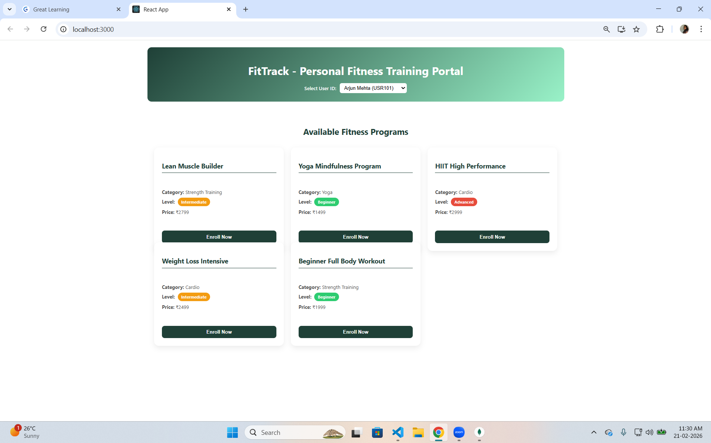
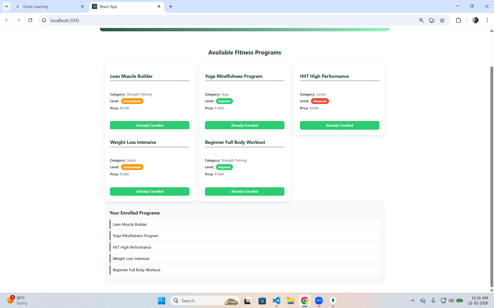
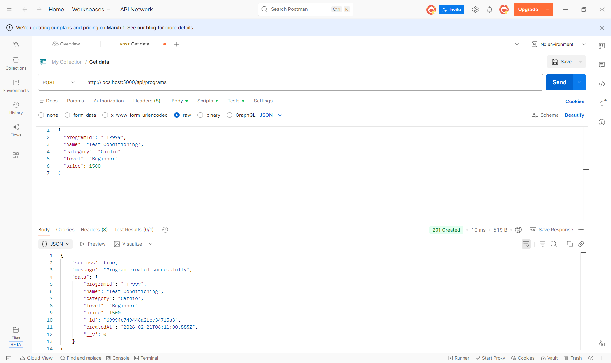
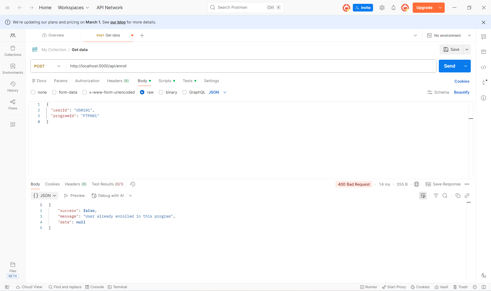
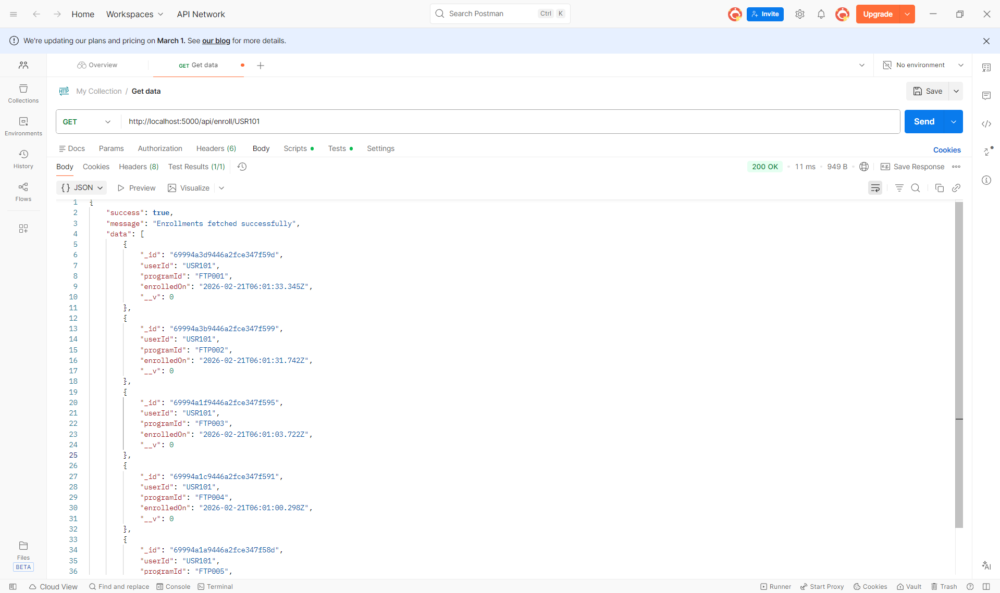
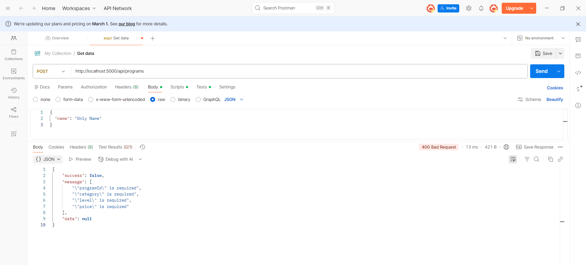
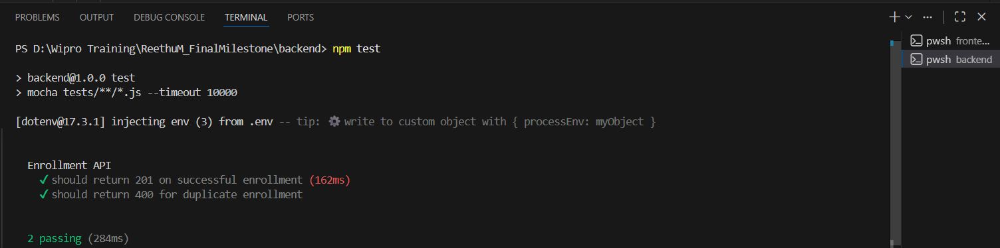

# FitTrack – Personal Fitness Training Portal (MERN)

## Final Milestone Assessment
```
FitTrack is a MERN-based Personal Fitness Training Portal where users can:
- View available fitness programs
- Enroll in programs
- View their enrolled programs
```
------------------------------------------------------------

## Project Structure
```
FitTrack/
│
├── backend/
│   ├── config/
│   │   └── db.js
│   ├── controllers/
│   │   ├── programController.js
│   │   └── enrollmentController.js
│   ├── models/
│   │   ├── Program.js
│   │   └── Enrollment.js
│   ├── routes/
│   │   ├── programRoutes.js
│   │   └── enrollmentRoutes.js
│   ├── middleware/
│   │   ├── validation.js
│   │   └── errorHandler.js
│   ├── tests/
│   │   └── enrollment.test.js
│   ├── app.js
│   ├── server.js
│   ├── package.json
│   └── .env
│
├── frontend/
│   ├── src/
│   │   ├── components/
│   │   │   ├── ProgramList.js
│   │   │   ├── ProgramCard.js
│   │   │   ├── ProgramList.css
│   │   │   └── ProgramCard.css
│   │   ├── App.js
│   │   └── index.js
│   ├── package.json
│   └── .env
│
└── README.md
```
------------------------------------------------------------

## Backend Setup Instructions
```
1. Install Dependencies

cd backend  
npm install  

2. Configure Environment Variables

Create a `.env` file inside backend folder:

PORT=5000  
MONGODB_URI=mongodb://localhost:27017/fittrack  
MONGODB_URI_TEST=mongodb://localhost:27017/fittrack_test  

3. Start Backend Server

node server.js  

Server runs at:  
http://localhost:5000  
```
------------------------------------------------------------

## Run Backend Tests
```
cd backend  
npm test  

Expected Output:

Enrollment API  
✓ should return 201 on successful enrollment  
✓ should return 400 for duplicate enrollment  

2 passing  
```
------------------------------------------------------------

## Frontend Setup Instructions
```
1. Install Dependencies

cd frontend  
npm install  

2. Configure Frontend Environment

Create `.env` inside frontend:

REACT_APP_API_URL=http://localhost:5000/api  

3. Start Frontend

npm start  

Frontend runs at:  
http://localhost:3000  
```
------------------------------------------------------------

## API Endpoints
```
Program APIs:

POST /api/programs  
Create a new program.

GET /api/programs  
Fetch all programs.

Enrollment APIs:

POST /api/enroll  
Enroll a user in a program.

GET /api/enroll/:userId  
Fetch all enrollments for a specific user.
```
------------------------------------------------------------

## Screenshots Included

### 1️. Program Listing Page




### 2️. Already Enrolled Programs




### 3. API Testing – Create Program




### 4️. API Testing – Duplicate Enrollment



### 5️. API Testing – Get Enrollments



### 6️. API Testing – Validation Error



### 67. Testing 


------------------------------------------------------------

## Author

**Reethu M**

MERN Final Milestone Assessment  
